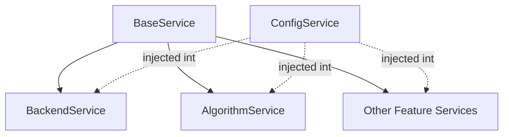

The Angular PWA Demo implements a comprehensive service architecture using Angular's dependency injection system with modern Angular 21 patterns.

## Service hierarchy

Services are organized in a hierarchical structure with a base service providing common functionality:



## Base service pattern

All HTTP-based services extend `BaseService` for consistent HTTP configuration:

```typescript base.service.ts:1-37
import { HttpClient, HttpHeaders } from '@angular/common/http';
import { Injectable              } from '@angular/core';
import { ConfigService           } from '../__Utils/ConfigService/config.service';

@Injectable({
  providedIn: 'root'
})
export class BaseService {

  ////////////////////////////////////////////////////////////////  
  // CAMPOS
  ////////////////////////////////////////////////////////////////  
  //
  public HTTPOptions_Text_Plain = {
    headers: new HttpHeaders(),
    'responseType'  : 'text' as 'json'
  };
    //
  public HTTPOptions_Text = {
    headers: new HttpHeaders({
      'Accept':'application/text'
    }),
    'responseType'  : 'text' as 'json'
  };
  //    
  public HTTPOptions_JSON = {
    headers: new HttpHeaders({
      'Content-Type' : 'application/json'
    })
    ,'responseType' : 'text' as 'json'
  }; 
  //
  constructor() { 

  }
}
```

<Info>
  The base service provides three HTTP option configurations for different response types: plain text, text with accept header, and JSON.
</Info>

## Modern dependency injection

Services use Angular 21's functional injection pattern:

<Tabs>
  <Tab title="Functional injection">
    ### Using inject() function

    The modern approach uses the `inject()` function instead of constructor parameters:

    ```typescript backend.service.ts:21-34
    @Injectable({
      providedIn: 'root'
    })
    export class BackendService extends BaseService implements OnInit {

      // v21: Inyección funcional (Reemplaza al constructor)
      public readonly http           = inject(HttpClient);
      public readonly _configService = inject(ConfigService);
      
      /**
       * v21 Feature: DestroyRef. 
       * Inyectarlo aquí captura el 'Injection Context' necesario para takeUntilDestroyed.
       */
      private readonly destroyRef = inject(DestroyRef);

      constructor() {
        // Ya no pasamos parámetros a super() porque usamos inject() en esta clase
        super();
      }
    }
    ```

    <Note>
      The `inject()` function provides better tree-shaking, clearer dependencies, and more flexible injection contexts.
    </Note>
  </Tab>

  <Tab title="Constructor injection">
    ### Traditional approach (still supported)

    Some services still use constructor-based injection:

    ```typescript algorithm.service.ts:7-15
    @Injectable({
      providedIn: 'root'
    })
    export class AlgorithmService extends BaseService {
        //
        constructor(public http: HttpClient, public _configService : ConfigService) { 
            //
            super();    
        }
    }
    ```

    Both approaches work, but functional injection is preferred for new code.
  </Tab>
</Tabs>

## Service organization

Services are organized by function into subdirectories:

<AccordionGroup>
  <Accordion title="Utils services">
    **Location**: `src/app/_services/__Utils/`

    Utility services provide cross-cutting concerns:

    - **ConfigService**: Configuration management and external config loading
    - **SearchService**: Search functionality
    - **SearchCustomService**: Custom search implementations
    - **SpeechService**: Speech recognition and synthesis
    - **ChatService**: Chat functionality
    - **VersionCacheService**: Version and cache management

    ```typescript config.service.ts:12-43
    export class ConfigService {
      constructor( protected http  : HttpClient
                  ,public    route : ActivatedRoute) 
      {
      } 
      // ONLY HAPPENS ONCE ON APPMODULE LOADING
      loadConfig() {
        return this.http.get('./assets/config/config.json').toPromise()
          .then((data: any) => {
              //
              _environment.externalConfig = data; // Assign loaded data to environment variable
          })
          .catch(error => {
            console.error('Error loading configuration:', error);
          });
      }
      //
      getConfigValue(key: string) {
        //
        let jsonData : string = JSON.parse(JSON.stringify(_environment.externalConfig))[key];
        //
        return jsonData;
      }
    }
    ```
  </Accordion>

  <Accordion title="Backend services">
    **Location**: `src/app/_services/BackendService/`

    The main backend service handles API communication:

    ```typescript backend.service.ts:49-74
    _GetWebApiAppVersion(): Observable<string> {
      const p_url = `${this._configService.getConfigValue('baseUrlNetCore')}api/Demos/GetAppVersion`;
      return this.http.get<string>(p_url, this.HTTPOptions_Text);
    }

    /**
     * v21 Fix: Pasamos 'this.destroyRef' a takeUntilDestroyed para evitar el error NG0203
     * ya que este método se llama asíncronamente (fuera del constructor).
     */
    public SetLog(p_PageTitle: string, p_logMsg: string, logType: LogType = LogType.Info): void {
      if (p_PageTitle === '' || p_logMsg === '') return;

      const p_url = `${this._configService.getConfigValue('baseUrlNetCore')}api/Demos/SetLog?p_logMsg=${p_logMsg}&logType=${logType.toString()}`;
      
      this.http.get<string>(p_url, this.HTTPOptions_Text)
        .pipe(takeUntilDestroyed(this.destroyRef)) 
        .subscribe({
          next: (logResult) => { /* Silently handle success */ },
          error: (err) => { /* Silently handle error to avoid infinite loops */ }
        });
    }
    ```
  </Accordion>

  <Accordion title="Feature services">
    **Location**: Various subdirectories

    Feature-specific services:

    - **AlgorithmService** (`_services/AlgorithmService/`): Algorithm demonstrations
    - **TetrisService** (`_services/__Games/TetrisService/`): Tetris game logic
    - **SudokuService** (`_services/__Games/SudokuService/`): Sudoku game logic
    - **PdfService** (`_services/__FileGeneration/`): PDF generation
  </Accordion>

  <Accordion title="AI services">
    **Location**: `src/app/_services/__AI/`

    AI and machine learning services:

    - **OCRService**: Optical character recognition
    - **ComputerVisionService**: Computer vision capabilities
    - **TensorflowService**: TensorFlow integration
  </Accordion>
</AccordionGroup>

## Service lifecycle management

Angular 21 introduces `DestroyRef` for cleaner subscription management:

<CodeGroup>
```typescript Using DestroyRef
// Inject DestroyRef to capture destruction context
private readonly destroyRef = inject(DestroyRef);

// Use with takeUntilDestroyed for automatic cleanup
this.http.get<string>(p_url, this.HTTPOptions_Text)
  .pipe(takeUntilDestroyed(this.destroyRef)) 
  .subscribe({
    next: (data) => { /* handle data */ },
    error: (err) => { /* handle error */ }
  });
```

```typescript Old approach (not recommended)
// Old way: manual subscription tracking
private subscription: Subscription;

ngOnInit() {
  this.subscription = this.http.get(...).subscribe(...);
}

ngOnDestroy() {
  this.subscription?.unsubscribe();
}
```
</CodeGroup>

<Warning>
  When calling `takeUntilDestroyed()` outside the injection context (like in async callbacks), you must explicitly pass the `DestroyRef` instance.
</Warning>

## Configuration-driven API calls

Services use `ConfigService` to retrieve API endpoints from external configuration:

```typescript algorithm.service.ts:42-49
getRandomVertex(vertexSize : Number,sourcePoint : Number): Observable<string> {
  //
  let p_url    = `${this._configService.getConfigValue('baseUrlNetCore')}api/Dijkstra/GenerateRandomVertex?p_vertexSize=${vertexSize}&p_sourcePoint=${sourcePoint}`;
  //
  let dijkstraData : Observable<string> =  this.http.get<string>(p_url,this.HTTPOptions_Text);
  //
  return dijkstraData; 
}
```

### Benefits of configuration-driven approach

<CardGroup cols={2}>
  <Card title="Environment flexibility" icon="globe">
    Switch between dev, staging, and production APIs without code changes
  </Card>
  <Card title="External configuration" icon="file-code">
    Update API endpoints by modifying JSON files, no rebuild required
  </Card>
  <Card title="Multi-backend support" icon="server">
    Support multiple backend technologies (.NET, Java, Node.js, Python)
  </Card>
  <Card title="Runtime configuration" icon="clock">
    Load configuration at runtime via APP_INITIALIZER
  </Card>
</CardGroup>

## Multi-backend architecture

The application demonstrates polyglot backend support:

```typescript algorithm.service.ts:42-67
// .NET Core backend
getRandomVertex(vertexSize : Number,sourcePoint : Number): Observable<string> {
  let p_url = `${this._configService.getConfigValue('baseUrlNetCore')}api/Dijkstra/GenerateRandomVertex?p_vertexSize=${vertexSize}&p_sourcePoint=${sourcePoint}`;
  return this.http.get<string>(p_url,this.HTTPOptions_Text);
}

// C++ backend via .NET Core
getRandomVertexCpp(vertexSize : Number,sourcePoint : Number): Observable<string> {
  let p_url = `${this._configService.getConfigValue('baseUrlNetCoreCPPEntry')}api/Algorithm/GenerateRandomVertex_CPP?p_vertexSize=${vertexSize}&p_sourcePoint=${sourcePoint}`;
  return this.http.get<string>(p_url,this.HTTPOptions_Text);
}

// Spring Boot (Java) backend
getRandomVertexSpringBoot(vertexSize : Number,sourcePoint : Number): Observable<string> {
  let p_url = `${this._configService.getConfigValue('baseUrlSpringBootJava')}GenerateRandomVertex_SpringBoot`;
  return this.http.get<string>(p_url,this.HTTPOptions_Text_Plain);
}
```

<Note>
  This architecture demonstrates how a single frontend can communicate with multiple backend technologies, useful for microservices or technology migration scenarios.
</Note>

## Speech service example

The `SpeechService` demonstrates browser API integration:

```typescript speech.service.ts:1-41
import { Injectable } from '@angular/core';

@Injectable({
  providedIn: 'root'
})
export class SpeechService {

  recognition         : any;
  isListening         : boolean   = false;
  transcript          : string    = '';
  error               : string    = '';
  constructor() { 

        // Initialize the SpeechRecognition object
        const SpeechRecognition = (window as any).SpeechRecognition || (window as any).webkitSpeechRecognition;
        if (SpeechRecognition) {
          this.recognition = new SpeechRecognition();
          this.recognition.lang = 'en-US'; // Set language
          this.recognition.interimResults = false; // Only final results
          this.recognition.maxAlternatives = 1;
    
          // Event handlers
          this.recognition.onresult = (event: any) => {
            //
            this.transcript = event.results[0][0].transcript;
            //console.log('Transcript:', this.transcript);
          };
    
          this.recognition.onerror = (event: any) => {
            this.error = event.error;
            this.isListening = false;
            console.error('Error:', this.error);
          };
          //
          this.recognition.onend = () => {
            //
          };
        } else {
          console.info('Speech Recognition API is not supported in your browser.');
        }
  }
}
```

### Key patterns demonstrated

<AccordionGroup>
  <Accordion title="Browser API integration">
    Services can wrap browser APIs for Angular integration:
    - Feature detection for API availability
    - Event handler binding in constructor
    - Error handling for unsupported browsers
  </Accordion>

  <Accordion title="Stateful services">
    Services can maintain state:
    - `isListening`: Current recording state
    - `transcript`: Latest recognized text
    - `error`: Last error message
  </Accordion>

  <Accordion title="Cross-browser compatibility">
    ```typescript
    const SpeechRecognition = 
      (window as any).SpeechRecognition || 
      (window as any).webkitSpeechRecognition;
    ```
    Handles vendor prefixes for browser compatibility.
  </Accordion>
</AccordionGroup>

## Service registration

Services use `providedIn: 'root'` for singleton behavior:

```typescript
@Injectable({
  providedIn: 'root'
})
```

### Benefits of root-level provision

<CardGroup cols={2}>
  <Card title="Singleton pattern" icon="circle-dot">
    One instance shared across the entire application
  </Card>
  <Card title="Tree-shakable" icon="tree">
    Unused services are automatically removed from production builds
  </Card>
  <Card title="No module import" icon="ban">
    No need to add to providers array in any module
  </Card>
  <Card title="Lazy loading safe" icon="check">
    Works correctly with lazy-loaded modules
  </Card>
</CardGroup>

## HTTP interceptor pattern

The application uses functional HTTP interceptors:

```typescript app.module.ts:39-60
export const loggingInterceptor: HttpInterceptorFn = (req: HttpRequest<unknown>, next: HttpHandlerFn) => {
  const started = Date.now();
  const backend = inject(BackendService); // Injecting service inside function
  let status: string = 'pending';

  return next(req).pipe(
    tap({
      next: (event) => {
        if (event instanceof HttpResponse) status = 'succeeded';
      },
      error: (error: HttpErrorResponse) => {
        status = 'failed';
        // Auto-report network errors to your backend log
        backend.SetLog("[HTTP ERROR]", `URL: ${req.url} - Status: ${error.status}`, LogType.Error);
      }
    }),
    finalize(() => {
      const elapsed = Date.now() - started;
      console.warn(`[HTTP LOG]: ${req.method} "${req.urlWithParams}" ${status} in ${elapsed} ms.`);
    })
  );
};
```

<Info>
  Functional interceptors are lighter weight than class-based interceptors and support dependency injection via `inject()`.
</Info>

## Error handling service

Global error handling is implemented as a service:

```typescript app.module.ts:66-74
@Injectable({ providedIn: 'root' })
export class CustomErrorHandler implements ErrorHandler {
    private backendService = inject(BackendService);

    handleError(_error: Error): void { 
      console.error("[RUNTIME ERROR]:\n", _error); 
      this.backendService.SetLog("[RUNTIME ERROR]", _error.message, LogType.Error);
    } 
}
```

Registered in the app module:

```typescript app.module.ts:113
{ provide: ErrorHandler, useClass: CustomErrorHandler }
```

## Best practices demonstrated

<AccordionGroup>
  <Accordion title="Separation of concerns">
    - Services handle business logic and data access
    - Components handle presentation and user interaction
    - Base classes provide shared functionality
  </Accordion>

  <Accordion title="Configuration over code">
    - API endpoints in external configuration files
    - Environment-specific settings loaded at runtime
    - No hardcoded URLs in service code
  </Accordion>

  <Accordion title="Consistent HTTP handling">
    - Standardized HTTP options via base service
    - Centralized error logging via interceptor
    - Proper subscription cleanup with DestroyRef
  </Accordion>

  <Accordion title="Modern Angular patterns">
    - Functional dependency injection with `inject()`
    - Functional HTTP interceptors
    - Automatic cleanup with `takeUntilDestroyed()`
    - Singleton services with `providedIn: 'root'`
  </Accordion>
</AccordionGroup>

## Next steps

<CardGroup cols={2}>
  <Card title="Architecture overview" href="/architecture/overview" icon="sitemap">
    Review the complete application architecture
  </Card>
  <Card title="Routing system" href="/architecture/routing" icon="route">
    Understand the routing configuration
  </Card>
  <Card title="PWA features" href="/architecture/pwa-features" icon="mobile">
    Learn about Progressive Web App capabilities
  </Card>
  <Card title="API reference" href="/api-reference/introduction" icon="book">
    Explore the complete API documentation
  </Card>
</CardGroup>