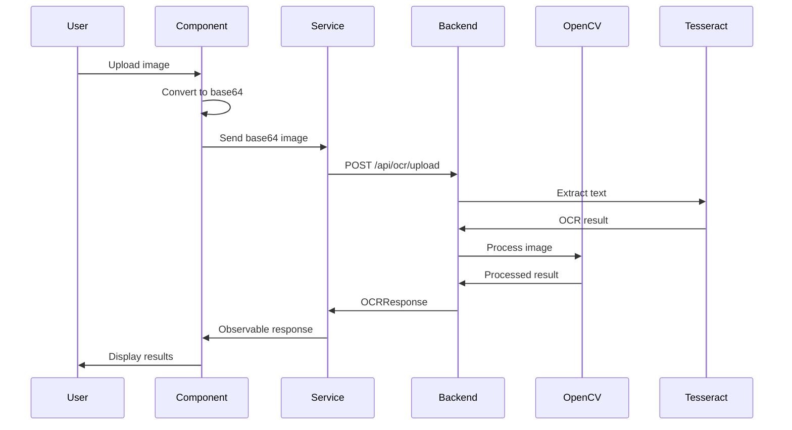

The Angular PWA Demo includes computer vision capabilities powered by OpenCV (C++ backend and OpenCV.js) and OCR functionality using Tesseract.

## Overview

<CardGroup cols={2}>
  <Card title="OpenCV" icon="image" href="#opencv-features">
    Image processing and shape detection
  </Card>
  <Card title="OCR" icon="text" href="#ocr-optical-character-recognition">
    Text extraction from images
  </Card>
  <Card title="Fractals" icon="infinity" href="#fractal-generation">
    Julia set fractal generation
  </Card>
  <Card title="Shape detection" icon="shapes" href="#shape-detection">
    Detect circles, rectangles, and triangles
  </Card>
</CardGroup>

## OpenCV features

The application uses OpenCV for image processing through both a C++ backend and client-side OpenCV.js.

### Backend configuration

The Computer Vision service connects to a C++ backend for processing:

```typescript Service
// src/app/_services/__AI/ComputerVisionService/Computer-Vision.service.ts

@Injectable({ providedIn: 'root' })
export class ComputerVisionService extends BaseService {
  private readonly http = inject(HttpClient);
  private readonly _configService = inject(ConfigService);
  
  private readonly __baseUrl = `${this._configService.getConfigValue('baseUrlNetCoreCPPEntry')}api/computervision/`;
  
  _OpenCv_GetAppVersion(): Observable<string> {
    return this.http.get<string>(`${this.__baseUrl}GetAppVersion`, this.HTTPOptions_Text);
  }
  
  _OpenCv_GetAPIVersion(): Observable<string> {
    return this.http.get<string>(`${this.__baseUrl}GetAPIVersion`, this.HTTPOptions_Text);
  }
  
  _OpenCv_GetCPPSTDVersion(): Observable<string> {
    return this.http.get<string>(`${this.__baseUrl}GetCPPSTDVersion`, this.HTTPOptions_Text);
  }
}
```

### Image upload and processing

```typescript Upload
_OpenCv_CPP_uploadBase64Image(base64Image: string): Observable<OCRResponse> {
  return this.http.post<OCRResponse>(`${this.__baseUrl}uploadOpenCv`, { base64Image });
}
```

<Note>
  The service accepts base64-encoded images for processing. Convert your images to base64 before uploading.
</Note>

## Shape detection

Client-side shape detection using OpenCV.js with contour analysis:

### Implementation

```typescript OpenCV.js
_OpenCv_js_detectShapes(imageElement: HTMLImageElement): string[] {
  const shapes: string[] = [];
  const cv = (window as any).cv;
  if (!cv) return ['OpenCV not loaded'];
  
  // Read image
  const src = cv.imread(imageElement);
  const gray = new cv.Mat();
  const edges = new cv.Mat();
  
  // Convert to grayscale
  cv.cvtColor(src, gray, cv.COLOR_RGBA2GRAY, 0);
  
  // Edge detection
  cv.Canny(gray, edges, 50, 150, 3, false);
  
  // Find contours
  const contours = new cv.MatVector();
  const hierarchy = new cv.Mat();
  cv.findContours(edges, contours, hierarchy, cv.RETR_EXTERNAL, cv.CHAIN_APPROX_SIMPLE);
  
  // Classify shapes
  for (let i = 0; i < contours.size(); i++) {
    const approx = new cv.Mat();
    cv.approxPolyDP(contours.get(i), approx, 0.04 * cv.arcLength(contours.get(i), true), true);
    
    if (approx.rows === 3) shapes.push('[Triangle]');
    else if (approx.rows === 4) shapes.push('[Rectangle/Square]');
    else if (approx.rows > 4) shapes.push('[Circle]');
    
    approx.delete();
  }
  
  // Cleanup
  src.delete();
  gray.delete();
  edges.delete();
  contours.delete();
  hierarchy.delete();
  
  return shapes;
}
```

### Shape classification logic

<Tabs>
  <Tab title="Triangle detection">
    ```typescript
    // Triangles have 3 vertices after polygon approximation
    if (approx.rows === 3) {
      shapes.push('[Triangle]');
    }
    ```
  </Tab>
  <Tab title="Rectangle detection">
    ```typescript
    // Rectangles and squares have 4 vertices
    if (approx.rows === 4) {
      shapes.push('[Rectangle/Square]');
    }
    ```
  </Tab>
  <Tab title="Circle detection">
    ```typescript
    // Circles have many vertices after approximation
    if (approx.rows > 4) {
      shapes.push('[Circle]');
    }
    ```
  </Tab>
</Tabs>

## OCR (Optical Character Recognition)

Extract text from images using Tesseract OCR with support for both C++ and Node.js backends.

### Service implementation

<CodeGroup>
```typescript Service
// src/app/_services/__AI/OCRService/ocr.service.ts

export interface OCRResponse {
  message: string;
  status?: string;
  data?: any;
}

@Injectable({
  providedIn: 'root'
})
export class OCRService extends BaseService {
  private readonly http = inject(HttpClient);
  private readonly _configService = inject(ConfigService);
  
  private readonly __baseUrl = `${this._configService.getConfigValue('baseUrlNetCoreCPPEntry')}api/ocr/`;
  
  // Version information
  _GetTesseract_CPPSTDVersion(): Observable<string> {
    return this.http.get<string>(`${this.__baseUrl}GetCPPSTDVersion`, this.HTTPOptions_Text);
  }
  
  _GetTesseract_AppVersion(): Observable<string> {
    return this.http.get<string>(`${this.__baseUrl}GetAppVersion`, this.HTTPOptions_Text);
  }
  
  _GetTesseract_APIVersion(): Observable<string> {
    return this.http.get<string>(`${this.__baseUrl}GetAPIVersion`, this.HTTPOptions_Text);
  }
}
```

```typescript C++ Backend
// Upload to C++ backend
uploadBase64ImageCPP(base64Image: string): Observable<OCRResponse> {
  return this.http.post<OCRResponse>(`${this.__baseUrl}upload`, { base64Image });
}
```

```typescript Node.js Backend
// Upload to Node.js backend
uploadBase64ImageNodeJs(base64Image: string): Observable<OCRResponse> {
  const nodeUrl = `${this._configService.getConfigValue('baseUrlNodeJsOcr')}upload`;
  return this.http.post<OCRResponse>(nodeUrl, { base64Image });
}
```
</CodeGroup>

### Usage example

```typescript Component
export class VisionComponent {
  constructor(private ocrService: OCRService) {}
  
  processImage(imageFile: File) {
    // Convert image to base64
    const reader = new FileReader();
    
    reader.onload = (e: any) => {
      const base64Image = e.target.result.split(',')[1];
      
      // Send to OCR service
      this.ocrService.uploadBase64ImageCPP(base64Image).subscribe({
        next: (response: OCRResponse) => {
          console.log('OCR Result:', response.message);
          console.log('Extracted text:', response.data);
        },
        error: (error) => {
          console.error('OCR Error:', error);
        }
      });
    };
    
    reader.readAsDataURL(imageFile);
  }
}
```

<Warning>
  OCR accuracy depends on image quality. Use high-resolution, well-lit images with clear text for best results.
</Warning>

## Fractal generation

Generate Julia set fractals with configurable parameters.

### API

```typescript Fractals
_OpenCv_GetFractal(
  p_maxIterations: number, 
  p_realPart: number, 
  p_imagPart: number
): Observable<Blob> {
  const url = `${this.__baseUrl}generatejuliaparams/?maxIterations=${p_maxIterations}&realPart=${p_realPart}&imagPart=${p_imagPart}`;
  return this.http.get(url, { responseType: 'blob' });
}
```

### Parameters

<ParamField path="p_maxIterations" type="number" required>
  Maximum number of iterations for fractal calculation. Higher values produce more detail but take longer to compute.
</ParamField>

<ParamField path="p_realPart" type="number" required>
  Real part of the complex constant c in the Julia set equation z = z² + c.
</ParamField>

<ParamField path="p_imagPart" type="number" required>
  Imaginary part of the complex constant c in the Julia set equation z = z² + c.
</ParamField>

### Example usage

```typescript Fractal Example
export class FractalComponent {
  constructor(private cvService: ComputerVisionService) {}
  
  generateFractal() {
    const maxIterations = 256;
    const realPart = -0.7;
    const imagPart = 0.27015;
    
    this.cvService._OpenCv_GetFractal(maxIterations, realPart, imagPart)
      .subscribe({
        next: (blob: Blob) => {
          // Create image URL from blob
          const imageUrl = URL.createObjectURL(blob);
          
          // Display in img element
          const imgElement = document.getElementById('fractal') as HTMLImageElement;
          imgElement.src = imageUrl;
        },
        error: (error) => {
          console.error('Fractal generation error:', error);
        }
      });
  }
}
```

## Image processing pipeline



## Type definitions

```typescript Types
// OCR Response interface
export interface OCRResponse {
  message: string;    // Extracted text or status message
  status?: string;    // Success/error status
  data?: any;         // Additional processing data
}

// Base service with HTTP options
export class BaseService {
  protected HTTPOptions_Text = {
    headers: new HttpHeaders({
      'Content-Type': 'text/plain'
    }),
    responseType: 'text' as 'json'
  };
}
```

## Best practices

<AccordionGroup>
  <Accordion title="Image preprocessing">
    - Resize large images before processing to reduce bandwidth
    - Use JPEG compression for photographs, PNG for screenshots
    - Validate image format before base64 conversion
    - Handle CORS issues when loading external images
  </Accordion>
  <Accordion title="OCR optimization">
    - Use high-contrast images for better accuracy
    - Apply image preprocessing (grayscale, threshold) before OCR
    - Consider image orientation and rotation
    - Test with different backends (C++, Node.js) for best results
  </Accordion>
  <Accordion title="OpenCV.js">
    - Load OpenCV.js asynchronously to avoid blocking
    - Clean up Mat objects to prevent memory leaks
    - Use Web Workers for intensive processing
    - Fallback to backend processing if client is slow
  </Accordion>
  <Accordion title="Error handling">
    - Validate backend availability before processing
    - Provide user feedback during long operations
    - Handle network errors gracefully
    - Implement retry logic for failed requests
  </Accordion>
</AccordionGroup>

## Performance considerations

<Note>
  **Client-side vs Server-side processing:**
  
  - **OpenCV.js (client-side):** Fast for simple operations, no server load, works offline
  - **C++ backend:** Better for complex operations, consistent performance, reduced client memory usage
  - **Node.js backend:** Good balance, easier deployment, TypeScript integration
  
  Choose based on your use case and infrastructure.
</Note>

## VisionHUB component

The `VisionHUBComponent` provides a unified interface for all computer vision and OCR features. It combines camera capture, signature pad, file upload, and processing into a single interactive component.

### Key features

**Multi-source input:**
- Camera capture (front/back camera switching)
- Signature pad with drawing capabilities
- File upload from device
- Image URL input

**Dual feature modes:**
1. **OCR mode**: Text extraction with Tesseract (Node.js or C++ backend)
2. **Computer Vision mode**: Shape detection with OpenCV (Node.js or C++ backend)

**Component structure:**

```typescript
// src/app/_modules/_Demos/_DemosFeatures/miscelaneous/VisionHUB/vision-HUB.component.ts

export class VisionHUBComponent extends BaseReferenceComponent {
  readonly selectedFeature = signal<number>(1);   // 1=OCR, 2=CV
  readonly selectedSource = signal<number>(0);    // Input source
  readonly selectedEngine = signal<number>(1);    // Backend engine
  readonly capturedImage = signal<string | null>(null);
  
  // Computed engine options based on feature
  readonly engineList = computed(() => {
    return this.selectedFeature() === 1 
      ? [{ id: 1, label: 'Tesseract -> Node.js' }, 
         { id: 2, label: 'Tesseract -> C++' }]
      : [{ id: 3, label: 'OpenCV -> Node.js' }, 
         { id: 4, label: 'OpenCV -> C++' }];
  });
}
```

<Info>
  VisionHUB uses Angular 21 signals and computed values for reactive UI updates. The engine list automatically adapts when switching between OCR and Computer Vision modes.
</Info>

## Related features

<CardGroup cols={2}>
  <Card title="Machine learning" icon="brain" href="/features/machine-learning">
    TensorFlow and AI features
  </Card>
  <Card title="File generation" icon="file" href="/features/file-generation">
    Export processed images to PDF
  </Card>
</CardGroup>
