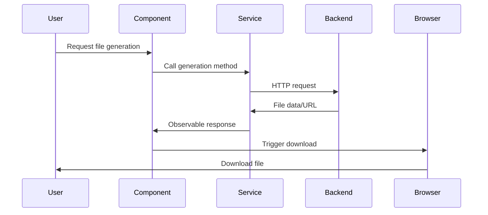

The Angular PWA Demo includes comprehensive file generation capabilities for exporting data and visualizations to various formats.

## Overview

<CardGroup cols={2}>
  <Card title="PDF generation" icon="file-pdf" href="#pdf-generation">
    Export canvas visualizations to PDF
  </Card>
  <Card title="CSV files" icon="file-csv" href="#csv-generation">
    Generate and download CSV data files
  </Card>
  <Card title="XLS files" icon="file-excel" href="#xls-generation">
    Create Excel spreadsheets
  </Card>
  <Card title="Charts" icon="chart-line" href="#chart-generation">
    Interactive data visualizations
  </Card>
</CardGroup>

## PDF generation

Export canvas-based visualizations (graphs, game boards, charts) to PDF files using html2canvas and jsPDF.

### Implementation

<CodeGroup>
```typescript Service
// src/app/_services/__FileGeneration/pdf.service.ts

import html2canvas from 'html2canvas';
import jsPDF from 'jspdf';

public _GetPDF(
  pageTitle: string, 
  c_canvas: any, 
  divCanvas_Pdf: any, 
  fileName: string
): Observable<string> {
  return new Observable<string>((observer) => 
    this.getPdf(pageTitle, c_canvas, divCanvas_Pdf, fileName, observer)
  );
}

getPdf(
  pageTitle: string, 
  c_canvas: any, 
  divCanvas_Pdf: any, 
  fileName: string, 
  observer: any
): void {
  const timestamp = new Date().toISOString().replace(/[:.]/g, '-');
  const finalFileName = `${fileName}_${timestamp}.pdf`;
  
  const areaToPrint = c_canvas.nativeElement;
  const borderToPrint = divCanvas_Pdf.nativeElement;
  
  (async () => {
    try {
      const canvas = await html2canvas(areaToPrint);
      
      const w: number = borderToPrint.offsetWidth;
      const h: number = borderToPrint.offsetHeight;
      const imgData: string = canvas.toDataURL('image/jpeg', 0.95);
      
      const pdfDoc: jsPDF = new jsPDF("landscape", "px", [w, h]);
      pdfDoc.addImage(imgData, 'JPEG', 0, 0, w, h);
      pdfDoc.save(finalFileName);
      
      observer.next(finalFileName);
      observer.complete();
    } catch (error) {
      observer.error(error);
    }
  })();
}
```

```typescript Usage
// Example: Export Dijkstra graph to PDF
_GetPDF(): void {
  this.status_message.set('[...Generating PDF...]');
  
  let fileName = "DIJKSTRA";
  
  this.pdfService._GetPDF(
    this.pageTitle,
    this.c_canvas,
    this.divCanvas_Pdf,
    fileName,
  ).subscribe({
    next: (fileName: string) => {
      // PDF generated
    },
    error: (error: Error) => {
      this.status_message.set('An error occurred : ' + error.message);
    },
    complete: () => {
      this.status_message.set(`[PDF file generated correctly]`);
    }
  });
}
```
</CodeGroup>

### Backend PDF generation

For server-side PDF generation:

```typescript Backend PDF
public GetPDF(subjectName: string | undefined): Observable<HttpEvent<any>> {
  const baseUrl = this._configService.getConfigValue('baseUrlNetCore');
  const p_url = `${baseUrl}api/PDFManager/GetPdf?subjectName=${subjectName}`;
  
  const req = new HttpRequest('GET', p_url, {
    reportProgress: true,
    responseType: 'text',
  });
  
  return this.http.request<any>(req);
}
```

<Note>
  PDF generation uses landscape orientation by default and includes timestamps in filenames.
</Note>

## CSV generation

Generate CSV files from backend data with support for multiple backend languages (C#, Node.js, Java, Python).

### Features

- Multi-backend support (.NET Core, Node.js, Spring Boot, Django)
- Paginated data tables with Material UI
- Direct download links
- File upload support

### Implementation

<Tabs>
  <Tab title="Data fetching">
    ```typescript Component
    // src/app/_modules/_Demos/_DemosFeatures/files-generation/files-generation-csv/files-generation-csv.component.ts
    
    SetCSVData(): void {
      this.status_message.set("Generating please wait...");
      
      let selectedIndex = this._languajeList.nativeElement.options.selectedIndex;
      
      switch (selectedIndex) {
        case 1: // .NET Core
          let csv_informeLogRemoto = this.backendService.getInformeRemotoCSV();
          
          csv_informeLogRemoto.subscribe({
            next: (csv_data: string) => {
              let jsondata = JSON.parse(csv_data);
              let recordNumber = jsondata.length;
              
              this.status_message.set("[" + recordNumber + "] records found");
              
              this.csv_dataSource = new MatTableDataSource<PersonEntity>(jsondata);
              this.csv_dataSource.paginator = this.csv_paginator;
            },
            error: (err: Error) => {
              this.status_message.set("[An error ocurred]");
            }
          });
          break;
          
        case 2: // Node.js
          let csv_informeLogRemoto_NodeJS = this.backendService.getInformeRemotoCSV_NodeJS();
          
          csv_informeLogRemoto_NodeJS.subscribe({
            next: (csv_data_node_js: string) => {
              let csv_data_node_js_json = JSON.parse(csv_data_node_js)['recordsets'][0];
              let recordNumber = csv_data_node_js_json.length;
              
              this.status_message.set("[" + recordNumber + "] records found");
              
              this.csv_dataSource = new MatTableDataSource<PersonEntity>(csv_data_node_js_json);
              this.csv_dataSource.paginator = this.csv_paginator;
            }
          });
          break;
      }
    }
    ```
  </Tab>
  <Tab title="Download link">
    ```typescript Download
    SetCSVLink() {
      this.status_message.set("Generating please wait ...");
      
      let csv_link = this.backendService.getCSVLink();
      
      csv_link.subscribe({
        next: (p_csv_link: string) => {
          let fileUrl = `${this.configService.getConfigValue('baseUrlNetCore')}${p_csv_link}`;
          let downloadLink_1 = fileUrl;
          
          while (downloadLink_1.indexOf("\"") > -1) 
            downloadLink_1 = downloadLink_1.replace("\"", "");
          
          this.downloadLink = downloadLink_1;
          this.status_message.set("CSV file genetated correctly");
        },
        error: (err: Error) => {
          this.downloadCaption = "";
          this.status_message.set("An error occured generating CSV file. Please try again");
        },
        complete: () => {
          this.downloadCaption = "[Donwload CSV]";
        }
      });
    }
    ```
  </Tab>
  <Tab title="Table display">
    ```typescript Table
    // Material table configuration
    public csv_dataSource = new MatTableDataSource<PersonEntity>();
    public csv_displayedColumns = ['id_Column', 'ciudad', 'nombreCompleto'];
    
    @ViewChild("csv_paginator", {read: MatPaginator}) csv_paginator!: MatPaginator;
    
    // After data fetch
    this.csv_dataSource = new MatTableDataSource<PersonEntity>(jsondata);
    this.csv_dataSource.paginator = this.csv_paginator;
    ```
  </Tab>
</Tabs>

## XLS generation

Create Excel spreadsheets from database queries with filtering and pagination.

### Features

- Server-side XLS generation
- Date range filtering
- Row limit configuration
- Multi-backend support

### Implementation

```typescript Component
// src/app/_modules/_Demos/_DemosFeatures/files-generation/files-generation-xls/files-generation-xls.component.ts

td_GenerarInformeXLS(_searchCriteria: SearchCriteria) {
  let td_excelFileName = this.backendService.getInformeExcel(this._model);
  
  this.td_ExcelDownloadLink = "#";
  this.td_buttonCaption_xls = "[Generating please wait ...]";
  this.status_message.set("[Generating please wait ...]");
  
  td_excelFileName.subscribe({
    next: (_excelFileName: string) => {
      let urlFile = UtilManager.DebugHostingContent(_excelFileName);
      
      this.td_ExcelDownloadLink = `${this.configService.getConfigValue('baseUrlNetCore')}/wwwroot/xlsx/${urlFile}`;
      
      this.status_message.set("[XLS file generated correctly]");
      this.td_textStatus_xls = "[Download XLS File]";
    },
    error: (err: Error) => {
      this.td_buttonCaption_xls = "[An error ocurred]";
      this.td_textStatus_xls = "[An error ocurred]";
      this.status_message.set("[An error ocurred]");
    },
    complete: () => {
      this.td_buttonCaption_xls = "[Generate XLS]";
    }
  });
}
```

### Search criteria

```typescript Search Form
rf_searchForm = this.formBuilder.group({
  _P_ROW_NUM: ["999", Validators.required],
  _P_FECHA_INICIO: ["2023-01-01", Validators.required],
  _P_FECHA_FIN: ["2022-12-31", Validators.required],
});

_model = new SearchCriteria(
  "1",
  "1",
  "999",
  "2022-09-01",
  "2022-09-30",
  "",
  ""
);
```

## Chart generation

Create interactive charts using Chart.js with pie charts, bar charts, and line graphs.

### Chart types

<Tabs>
  <Tab title="Pie chart">
    ```typescript Pie Chart
    // src/app/_modules/_Demos/_DemosFeatures/files-generation/chart/chart.component.ts
    
    SetPieChart(): void {
      const statLabels: string[] = [];
      const statData: Number[] = [];
      const statBackgroundColor: string[] = [];
      
      let csv_informeLogRemoto = this.backendService.getInformeRemotoCSV_STAT();
      
      csv_informeLogRemoto.subscribe({
        next: (csv_data: string) => {
          let jsondata = JSON.parse(csv_data);
          
          jsondata.forEach((element: JSON, index: number) => {
            statLabels.push(jsondata[index]["ciudad"]);
            statData.push(Number(jsondata[index]["id_Column"]));
            
            let randomNumber_1 = Math.floor(Math.random() * 100);
            let randomNumber_2 = Math.floor(Math.random() * 100);
            let randomNumber_3 = Math.floor(Math.random() * 100);
            
            let rgbStr = 'rgb('
              + (Number(jsondata[index]["id_Column"]) + randomNumber_1) + ','
              + (Number(jsondata[index]["id_Column"]) + randomNumber_2) + ','
              + (Number(jsondata[index]["id_Column"]) + randomNumber_3) + ')';
            
            statBackgroundColor.push(rgbStr);
          });
        },
        complete: () => {
          const data = {
            labels: statLabels,
            datasets: [{
              label: 'CITIES',
              data: statData,
              backgroundColor: statBackgroundColor,
              hoverOffset: 4
            }]
          };
          
          let context = this.canvas_csv.nativeElement.getContext('2d');
          
          this.pieChartVar_csv = new Chart(context, {
            type: 'pie',
            data: data,
            options: {
              responsive: true,
              plugins: {
                legend: {
                  position: 'bottom',
                },
                title: {
                  display: true,
                  text: 'CITIES'
                }
              }
            }
          });
        }
      });
    }
    ```
  </Tab>
  <Tab title="Bar chart">
    ```typescript Bar Chart
    SetBarChart(): void {
      const statLabels: string[] = [];
      const statData: Number[] = [];
      const statBackgroundColor: string[] = [];
      
      let td_informeLogStat = this.backendService.getLogStatGET();
      
      td_informeLogStat.subscribe({
        next: (rawData: string) => {
          let jsondata = JSON.parse(rawData);
          
          jsondata.forEach((element: JSON, index: number) => {
            statLabels.push(jsondata[index]["pageName"] + " - " + jsondata[index]["ipValue"]);
            statData.push(Number(jsondata[index]["ipValue"]));
            statBackgroundColor.push('rgb('
              + (Number(jsondata[index]["ipValue"]) / 4) + ','
              + (Number(jsondata[index]["ipValue"]) / 3) + ','
              + (Number(jsondata[index]["ipValue"]) / 2) + ')');
          });
        },
        complete: () => {
          const data = {
            labels: statLabels,
            datasets: [{
              label: 'SESSION COUNT',
              data: statData,
              backgroundColor: statBackgroundColor,
              hoverOffset: 4
            }]
          };
          
          let context = this.canvas_xls.nativeElement.getContext('2d');
          
          this.pieChartVar_xls = new Chart(context, {
            type: 'bar',
            data: data,
            options: {
              responsive: true,
              plugins: {
                legend: {
                  position: 'top',
                },
                title: {
                  display: true,
                  text: 'SESSION COUNT'
                }
              }
            }
          });
        }
      });
    }
    ```
  </Tab>
  <Tab title="Export to PDF">
    ```typescript Export
    GetPDF(P_fileName: string): void {
      (P_fileName == '[PIE CHART]') 
        ? this.pdf_message_csv.set('[...Generating PDF...]') 
        : this.pdf_message_xls.set('[...Generating PDF...]');
      
      this.pdfService._GetPDF(
        P_fileName,
        (P_fileName == '[PIE CHART]') ? this.canvas_csv : this.canvas_xls,
        (P_fileName == '[PIE CHART]') ? this.divPieChart_CSV : this.divPieChart_xls,
        P_fileName,
      ).subscribe({
        next: (fileName: string) => {
          // PDF generated
        },
        error: (error: Error) => {
          let msg = 'An error occurred : ' + error.message;
          (P_fileName == '[PIE CHART]') 
            ? this.pdf_message_csv.set(msg) 
            : this.pdf_message_xls.set(msg);
        },
        complete: () => {
          let msg = `PDF file generated correctly`;
          (P_fileName == '[PIE CHART]') 
            ? this.pdf_message_csv.set(msg) 
            : this.pdf_message_xls.set(msg);
        }
      });
    }
    ```
  </Tab>
</Tabs>

### Chart.js configuration

```typescript Setup
import { Chart, registerables } from 'chart.js';

constructor() {
  Chart.register(...registerables);
}

@ViewChild('canvas_csv') canvas_csv: any;
@ViewChild('canvas_xls') canvas_xls: any;

public pieChartVar_csv: any;
public pieChartVar_xls: any;
```

<Warning>
  Remember to register Chart.js components before using them in the constructor.
</Warning>

## File generation workflow



## Best practices

<AccordionGroup>
  <Accordion title="PDF generation">
    - Use landscape orientation for wide visualizations
    - Include timestamps in filenames for uniqueness
    - Handle errors gracefully with user feedback
    - Consider file size for large canvases
  </Accordion>
  <Accordion title="CSV/XLS generation">
    - Validate data before sending to backend
    - Show loading indicators during generation
    - Provide download links instead of automatic downloads
    - Clean up temporary files on the server
  </Accordion>
  <Accordion title="Chart generation">
    - Use responsive chart configurations
    - Generate dynamic colors for better visualization
    - Include legends and titles for clarity
    - Export charts to PDF for sharing
  </Accordion>
</AccordionGroup>

## Related features

<CardGroup cols={2}>
  <Card title="Computer vision" icon="eye" href="/features/computer-vision">
    Image processing and OCR features
  </Card>
  <Card title="Algorithms" icon="function" href="/features/algorithms">
    Algorithm visualizations for export
  </Card>
</CardGroup>
