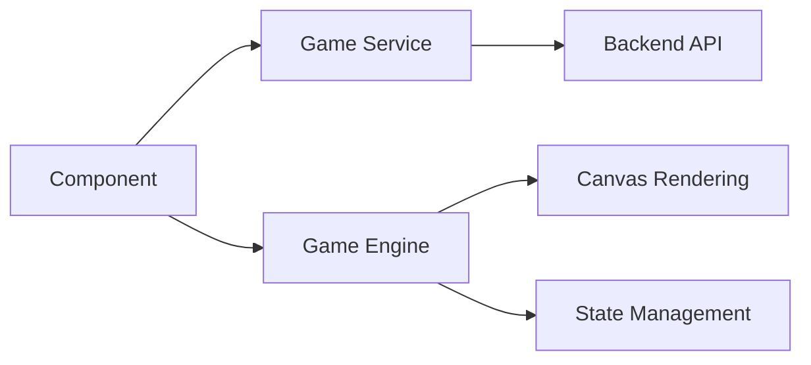

The Angular PWA Demo includes several classic games with AI implementations, demonstrating game logic, minimax algorithms, and automated solvers.

## Overview

<CardGroup cols={2}>
  <Card title="Sudoku" icon="grid" href="#sudoku">
    Generate and solve Sudoku puzzles
  </Card>
  <Card title="Tic-Tac-Toe" icon="x" href="#tic-tac-toe">
    Play against minimax AI opponent
  </Card>
  <Card title="Tower of Hanoi" icon="tower-observation" href="#tower-of-hanoi">
    Manual play or automated solver
  </Card>
  <Card title="Tetris" icon="cubes" href="#tetris">
    Classic game with AI auto-play
  </Card>
</CardGroup>

## Sudoku

Generate and solve 9×9 Sudoku puzzles using backend algorithms in C++ or Node.js.

### Key features

- Puzzle generation from backend or file upload
- Multiple solver backends (C++, Node.js)
- Board validation
- PDF export of puzzles
- Visual highlighting of solved cells

### Implementation

<CodeGroup>
```typescript Component
// src/app/_modules/_Demos/_DemosFeatures/games/game-sudoku/game-sudoku.component.ts

public GenerateFromBackend(): void {
  this.status_message.set("[...generating...]");
  
  let generatedSudoku: Observable<string>;
  let selectedIndex: number = this._languajeList.nativeElement.options.selectedIndex;
  
  switch (selectedIndex) {
    case 1: // C++
      generatedSudoku = this._sudokuService._GetSudoku_CPP();
      break;
    case 2: // Node.js
      generatedSudoku = this._sudokuService._GetSudoku_NodeJS();
      break;
    default:
      return;
  }
  
  this.sudokuSolved = false;
  this.btnGenerateCaption = '[...generating...]';
  
  generatedSudoku.subscribe({
    next: (jsondata: string) => {
      this._sudokuGenerated = jsondata;
      
      // Parse JSON to 2D array
      jsondata = jsondata.replaceAll('[', '').replaceAll(']', '');
      jsondata = jsondata.replaceAll('},', '|');
      let jsonDataArray = jsondata.split('|');
      
      this.board = [];
      for (let i = 0; i < 9; i++) {
        const row: number[] = [];
        const rowString = jsonDataArray[i].split(',');
        for (let j = 0; j < 9; j++) {
          row.push(parseInt(rowString[j]));
        }
        this.board.push(row);
      }
      
      this.status_message.set("[Generated correctly]");
    }
  });
}
```

```typescript Service
// src/app/_services/__Games/SudokuService/sudoku.service.ts

_GetSudoku_CPP(): Observable<string> {
  let p_url = `${this._configService.getConfigValue('baseUrlNetCoreCPPEntry')}api/Algorithm/Sudoku_Generate_CPP`;
  return this.http.get<string>(p_url, this.HTTPOptions_Text);
}

_SolveSudoku_CPP(p_matrix: string): Observable<string> {
  let p_url = `${this._configService.getConfigValue('baseUrlNetCoreCPPEntry')}api/Algorithm/Sudoku_Solve_CPP?p_matrix=${p_matrix}`;
  return this.http.get<string>(p_url, this.HTTPOptions_Text);
}

_SolveSudoku_NodeJS(p_matrix: string): Observable<string> {
  let p_url = `${this._configService.getConfigValue('baseUrlNodeJs')}Sudoku_Solve_NodeJS?p_matrix=${p_matrix}`;
  return this.http.get<string>(p_url, this.HTTPOptions_Text);
}
```
</CodeGroup>

### Solving puzzles

```typescript Solver
public _SolveSudoku(): void {
  this.sudokuSolved = true;
  this.btnSolveCaption = '[...solving...]';
  
  let solveSudoku: Observable<string>;
  let selectedIndex = this._languajeList.nativeElement.options.selectedIndex;
  
  switch (selectedIndex) {
    case 1: // C++
      solveSudoku = this._sudokuService._SolveSudoku_CPP(this._sudokuGenerated);
      break;
    case 2: // Node.js
      solveSudoku = this._sudokuService._SolveSudoku_NodeJS(this._sudokuGenerated);
      break;
  }
  
  solveSudoku.subscribe({
    next: (jsondata: string) => {
      this.status_message.set("[Solved correctly]");
      // Update board with solution
    }
  });
}
```

<Note>
  Sudoku puzzles can also be uploaded from JSON files for solving.
</Note>

## Tic-Tac-Toe

Classic Tic-Tac-Toe game with an unbeatable AI opponent using the minimax algorithm.

### Minimax algorithm

The AI uses minimax with game tree exploration to find optimal moves:

```typescript Engine
// src/app/_engines/tictactoe.engine.ts

minimax(board: ('X' | 'O' | null)[][], depth: number, isAI: boolean): number | undefined {
  let score: number | undefined = 0;
  let bestScore: number | undefined = 0;
  
  if (this.gameOver(board) == true) {
    if (isAI == true) return -1;
    if (isAI == false) return +1;
  }
  
  if (depth < 9) {
    if (isAI == true) {
      bestScore = -999;
      for (let i = 0; i < this.SIDE; i++) {
        for (let j = 0; j < this.SIDE; j++) {
          if (board[i][j] == null) {
            board[i][j] = this.COMPUTERMOVE;
            score = this.minimax(board, depth + 1, false);
            board[i][j] = null;
            if (score! > bestScore!) {
              bestScore = score;
            }
          }
        }
      }
      return bestScore;
    } else {
      bestScore = 999;
      for (let i = 0; i < this.SIDE; i++) {
        for (let j = 0; j < this.SIDE; j++) {
          if (board[i][j] == null) {
            board[i][j] = this.HUMANMOVE;
            score = this.minimax(board, depth + 1, true);
            board[i][j] = null;
            if (score! < bestScore!) {
              bestScore = score;
            }
          }
        }
      }
      return bestScore;
    }
  } else {
    return 0;
  }
}
```

### Best move calculation

```typescript Best Move
bestMove(board: ('X' | 'O' | null)[][], moveIndex: number): number {
  let x = -1;
  let y = -1;
  let score: number | undefined = 0;
  let bestScore: number | undefined = -999;
  
  for (let i = 0; i < this.SIDE; i++) {
    for (let j = 0; j < this.SIDE; j++) {
      if (board[i][j] == null) {
        board[i][j] = this.COMPUTERMOVE;
        score = this.minimax(board, moveIndex + 1, false);
        board[i][j] = null;
        if (score! > bestScore!) {
          bestScore = score;
          x = i;
          y = j;
        }
      }
    }
  }
  return ((x * 3) + y);
}
```

### Game flow

```typescript Game Logic
makeMove(n: number) {
  if (this.squares[n] || this.winner) {
    return;
  }
  
  // Human move
  this.makeHumanMove(n);
  
  if (this._declareWinner() == false) {
    // Computer move
    this.makeComputerMove();
    this._declareWinner();
  }
}
```

## Tower of Hanoi

Classic Tower of Hanoi puzzle with both manual play mode and automated solver using Angular v21 signals.

### Signal-based state management

<Tabs>
  <Tab title="Manual play">
    ```typescript Manual
    // Angular v21: Signal updates for state changes
    manual_moveDisk(fromTower: number, toTower: number) {
      const currentState = this._gameState();
      const newState = currentState.map(tower => [...tower]);
      const diskToMove = newState[fromTower].pop();
      
      if (diskToMove) {
        const targetTower = newState[toTower];
        if (targetTower.length === 0 || 
            targetTower[targetTower.length - 1].size > diskToMove.size) {
          targetTower.push(diskToMove);
          
          // Signal update triggers change detection
          this._gameState.set(newState);
          this._moves.update(m => m + 1);
        }
      }
    }
    ```
  </Tab>
  <Tab title="Auto solver">
    ```typescript Auto Solver
    auto_towerOfHanoi(n: number, from_rod: string, to_rod: string, aux_rod: string): void {
      if (n === 0) return;
      
      this.auto_towerOfHanoi(n - 1, from_rod, aux_rod, to_rod);
      this.auto_saveStep(n, from_rod, to_rod);
      this.auto_towerOfHanoi(n - 1, aux_rod, to_rod, from_rod);
    }
    
    auto_printSteps() {
      if (this._stepsIndex > this._stepsAmt) {
        clearTimeout(this._timeoutId);
        return;
      }
      
      if (this._steps[this._stepsIndex]) {
        let hanoiStep = this._steps[this._stepsIndex];
        let message = `Step ${(this._stepsIndex + 1)} of ${this._stepsAmt}. Move disk ${hanoiStep.n} from Tower ${hanoiStep.from} to Tower ${hanoiStep.to}`;
        this.steps.push(message);
        this.auto_makeMove(hanoiStep);
      }
      
      this._stepsIndex++;
      this._timeoutId = setTimeout(() => {
        this.auto_printSteps();
      }, this._delayInMilliseconds);
    }
    ```
  </Tab>
  <Tab title="Win detection">
    ```typescript Win Detection
    // Computed signal for win condition
    public readonly isWin = computed(() => this._gameState()[2].length === 3);
    
    public _checkWinCondition(): boolean {
      return this.isWin(); // Delegate to computed signal
    }
    ```
  </Tab>
</Tabs>

<Note>
  The Hanoi engine uses Angular v21's signal-based state management for reactive updates without RxJS observables.
</Note>

## Tetris

Classic Tetris game with AI auto-play capability powered by a C++ backend.

### Game management

```typescript Service
// src/app/_services/__Games/TetrisService/tetris.service.ts

createGame(): Observable<{ message: string; handle: number }> {
  return this.http.post<{ message: string; handle: number }>(`${this.apiUrl}/create`, {}).pipe(
    tap(() => {
      this.gameCreated = true;
      console.log('✅ Game instance created');
    }),
    catchError(this.handleError)
  );
}

step(): Observable<any> {
  if (!this.gameCreated) {
    return throwError(() => new Error('Game not created. Call createGame() first.'));
  }
  return this.http.post(`${this.apiUrl}/step`, {}).pipe(
    catchError(this.handleError)
  );
}

getState(): Observable<TetrisState | null> {
  if (!this.gameCreated) {
    return of(null);
  }
  
  return this.http.get<TetrisState>(`${this.apiUrl}/state`).pipe(
    catchError(err => {
      console.warn('⚠️ State fetch failed:', err);
      return of(null);
    })
  );
}
```

### AI features

<CodeGroup>
```typescript Training
trainAI(weightsFile: string = 'tetris_weights.txt', generations: number = 20): Observable<any> {
  return this.http.post(`${this.apiUrl}/train`, { weightsFile, generations }).pipe(
    tap(() => console.log('✅ AI training complete')),
    catchError(this.handleError)
  );
}
```

```typescript Auto-play
startAutoPlay(): void {
  if (this.autoPlaySub || !this.gameCreated) return;
  this.autoPlaySub = interval(100).subscribe(() => {
    this.step().subscribe({ 
      error: err => console.error('Auto-play error:', err) 
    });
  });
}

stopAutoPlay(): void {
  if (this.autoPlaySub) {
    this.autoPlaySub.unsubscribe();
    this.autoPlaySub = null;
  }
}
```

```typescript Weights
getAIWeights(): Observable<AIWeights> {
  return this.http.get<AIWeights>(`${this.apiUrl}/ai-weights`).pipe(
    catchError(this.handleError)
  );
}

setAIWeights(weights: AIWeights): Observable<any> {
  if (!this.gameCreated) return throwError(() => new Error('Game not created.'));
  return this.http.post(`${this.apiUrl}/ai-weights`, weights).pipe(
    catchError(this.handleError)
  );
}
```
</CodeGroup>

## Game architecture

All games follow a consistent architecture pattern:



<AccordionGroup>
  <Accordion title="Component layer">
    Handles user input, UI state, and orchestrates game flow. Uses Angular reactive forms and signals for state management.
  </Accordion>
  <Accordion title="Service layer">
    Manages HTTP communication with backend services for game generation, solving, and AI features.
  </Accordion>
  <Accordion title="Engine layer">
    Implements game logic, AI algorithms (minimax), and state validation. Pure TypeScript classes for portability.
  </Accordion>
  <Accordion title="Rendering layer">
    Canvas-based or DOM-based rendering depending on the game. Optimized for performance and responsiveness.
  </Accordion>
</AccordionGroup>

## Related features

<CardGroup cols={2}>
  <Card title="Algorithms" icon="function" href="/features/algorithms">
    Algorithm visualizations and demos
  </Card>
  <Card title="Machine learning" icon="brain" href="/features/machine-learning">
    AI and TensorFlow implementations
  </Card>
</CardGroup>
