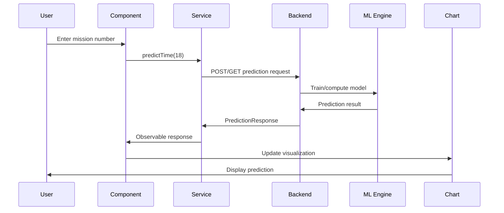

The Angular PWA Demo includes machine learning capabilities with linear regression implementations in both TensorFlow (Python) and native C++.

## Overview

<CardGroup cols={2}>
  <Card title="Linear regression" icon="chart-line" href="#linear-regression">
    Predict Apollo mission durations
  </Card>
  <Card title="TensorFlow" icon="brain" href="#tensorflow-implementation">
    Python/TensorFlow backend
  </Card>
  <Card title="C++ ML" icon="code" href="#c-implementation">
    Native C++ least squares method
  </Card>
  <Card title="Visualization" icon="chart-scatter" href="#chart-visualization">
    Interactive Chart.js graphs
  </Card>
</CardGroup>

## Linear regression

The application demonstrates linear regression with a real-world dataset: Apollo mission durations. Users can predict mission times based on historical data.

### Apollo mission predictor

Predict the total mission time and duration for Apollo missions using two different ML approaches:

<Tabs>
  <Tab title="Overview">
    The predictor uses historical Apollo mission data (missions 8-17) to train a linear regression model and predict future mission durations.
    
    **Historical data:**
    - Apollo 8: 147 hours
    - Apollo 10: 193 hours
    - Apollo 11: 195 hours
    - Apollo 12: 244 hours
    - Apollo 13: 142 hours (aborted)
    - Apollo 14: 217 hours
    - Apollo 15: 295 hours
    - Apollo 16: 265 hours
    - Apollo 17: 301 hours
  </Tab>
  <Tab title="Component">
    ```typescript
    // src/app/_modules/_Demos/_DemosFeatures/_machineLearning/LinearRegression/linear-regression/linear-regression.component.ts
    
    export class LinearRegressionComponent extends BaseReferenceComponent implements OnInit {
      title = 'Apollo Mission Time Predictor';
      inputMissionNumber: number | null = 18;
      predictionResult: PredictionResponse | null = null;
      isLoading: boolean = false;
      
      private historicalData = [
        { mission: 8,  time: 147.0 },
        { mission: 10, time: 193.0 },
        { mission: 11, time: 195.0 },
        { mission: 12, time: 244.0 },
        { mission: 13, time: 142.0 },
        { mission: 14, time: 217.0 },
        { mission: 15, time: 295.0 },
        { mission: 16, time: 265.0 },
        { mission: 17, time: 301.0 }
      ];
      
      constructor(
        public predictService: TensorFlowService,
        public decimalPipe: DecimalPipe
      ) {
        super(configService, backendService, route, speechService, PAGE_TITLE_NO_SOUND);
      }
    }
    ```
  </Tab>
  <Tab title="Prediction">
    ```typescript
    predict(): void {
      if (this.inputMissionNumber === null || this.inputMissionNumber < 1) {
        this.errorMessage = 'Please enter a valid mission number (1 or higher).';
        return;
      }
      
      this.isLoading = true;
      
      // C++ Engine
      if (this.linearRegressionEngine == 0) {
        this.predictService.predictTime_netcore_cpp(this.inputMissionNumber).subscribe({
          next: (response) => {
            this.predictionResult = response;
            let predicted_total_time_hours = this.decimalPipe.transform(response.predicted_total_time_hours, '1.2-2');
            let predicted_duration_days = this.decimalPipe.transform(response.predicted_duration_days, '1.2-2');
            
            this.status_message.set(
              `Input Mission Number: ${response.input_mission_number}, ` +
              `Predicted Total Time: ${predicted_total_time_hours} Hours, ` +
              `Predicted Duration: ${predicted_duration_days} Days`
            );
            
            this.updateChart(response.input_mission_number, response.predicted_total_time_hours);
          },
          complete: () => {
            this.isLoading = false;
          }
        });
      }
      
      // Python/TensorFlow Engine
      if (this.linearRegressionEngine == 1) {
        this.predictService.predictTime_tensorflow_python(this.inputMissionNumber).subscribe({
          next: (response) => {
            this.predictionResult = response;
            // Similar handling as C++
            this.updateChart(response.input_mission_number, response.predicted_total_time_hours);
          },
          complete: () => {
            this.isLoading = false;
          }
        });
      }
    }
    ```
  </Tab>
</Tabs>

## TensorFlow implementation

The Python/TensorFlow backend uses gradient descent for iterative optimization.

### Service interface

```typescript Service
// src/app/_services/__AI/TensorflowService/tensor-flow.service.ts

export interface PredictionRequest {
  mission_number: number;
}

export interface PredictionResponse {
  input_mission_number: number;
  predicted_total_time_hours: number;
  predicted_duration_days: number;
}

@Injectable({
  providedIn: 'root'
})
export class TensorFlowService extends BaseService {
  constructor(private http: HttpClient, public _configService: ConfigService) {
    super();
  }
  
  predictTime_tensorflow_python(missionNumber: number): Observable<PredictionResponse> {
    let apiUrl_tensorflow_python = `${this.getConfigValue('baseUrlDjangoPythonTF')}predict/`;
    
    const body: PredictionRequest = { mission_number: missionNumber };
    const headers = new HttpHeaders({
      'Content-Type': 'application/json'
    });
    
    return this.http.post<PredictionResponse>(apiUrl_tensorflow_python, body, { headers });
  }
}
```

### How it works

<Steps>
  <Step title="Data preparation">
    The backend receives mission number and prepares the input tensor.
  </Step>
  <Step title="Model training">
    TensorFlow trains a linear regression model using gradient descent on the historical Apollo mission data.
  </Step>
  <Step title="Prediction">
    The trained model predicts the mission duration based on the input mission number.
  </Step>
  <Step title="Response">
    Returns predicted hours and days in JSON format.
  </Step>
</Steps>

<Note>
  **TensorFlow approach:** Uses iterative optimization (gradient descent) to find an approximate solution. This approach is more flexible and can be extended to non-linear models.
</Note>

## C++ implementation

The C++ backend implements the least squares method for exact linear regression.

### Service method

```typescript C++ Service
predictTime_netcore_cpp(missionNumber: number): Observable<PredictionResponse> {
  let apiUrl_netcore_cpp = `${this.getConfigValue('baseUrlNetCoreCPPEntry')}api/linearregression/predict?missionNumberToPredict=${missionNumber}`;
  
  const headers = new HttpHeaders({
    'Content-Type': 'application/json'
  });
  
  return this.http.get<PredictionResponse>(apiUrl_netcore_cpp, { headers });
}
```

### Mathematical approach

The C++ implementation uses the least squares formula:

```
For linear regression y = mx + b:

m = (n∑xy - ∑x∑y) / (n∑x² - (∑x)²)
b = (∑y - m∑x) / n

Where:
- n = number of data points
- x = mission numbers
- y = mission durations
- m = slope
- b = y-intercept
```

<Note>
  **C++ approach:** Uses the closed-form least squares solution for exact computation. This is faster for simple linear models but less flexible than TensorFlow.
</Note>

## Chart visualization

The application uses Chart.js to visualize predictions alongside historical data.

### Chart configuration

<CodeGroup>
```typescript Setup
import { ChartData, ChartConfiguration, ChartType } from 'chart.js';
import { BaseChartDirective, NgChartsModule } from 'ng2-charts';

@ViewChild(BaseChartDirective) chart?: BaseChartDirective;

public chartType: ChartType = 'line';

public chartOptions: ChartConfiguration['options'] = {
  responsive: true,
  maintainAspectRatio: false,
  scales: {
    x: {
      title: {
        display: true,
        text: 'Mission Number'
      }
    },
    y: {
      title: {
        display: true,
        text: 'Total Mission Time (Hours)'
      }
    }
  },
  plugins: {
    title: {
      display: true,
      text: 'Apollo Mission Duration Prediction'
    }
  }
};
```

```typescript Data
public chartData: ChartData<'line'> = {
  labels: [],
  datasets: [
    {
      data: [],
      label: 'Actual Mission Times (Hours)',
      borderColor: '#3e95cd',
      backgroundColor: 'rgba(62, 149, 205, 0.2)',
      fill: false,
      pointRadius: 6,
      pointHoverRadius: 8,
      tension: 0.1
    },
    {
      data: [],
      label: 'Predicted Mission Time (Hours)',
      borderColor: '#ff6384',
      backgroundColor: 'rgba(255, 99, 132, 0.2)',
      fill: false,
      pointRadius: 8,
      pointHoverRadius: 10,
      pointStyle: 'triangle',
      showLine: false // Only show the predicted point
    }
  ]
};
```

```typescript Update
updateChart(predictedMission: number, predictedTime: number): void {
  const labels = [...this.historicalData.map(item => `Apollo ${item.mission}`)];
  const actualTimes = [...this.historicalData.map(item => item.time)];
  
  // Add predicted mission if not in historical data
  const predictedMissionLabel = `Apollo ${predictedMission}`;
  if (!labels.includes(predictedMissionLabel)) {
    labels.push(predictedMissionLabel);
    actualTimes.push(NaN); // No actual time for future missions
  }
  
  // Update chart data
  this.chartData.labels = labels;
  this.chartData.datasets[0].data = actualTimes;
  
  // Prepare prediction data array
  const predictionDataArray = new Array(labels.length).fill(NaN);
  const predictionIndex = labels.indexOf(predictedMissionLabel);
  if (predictionIndex !== -1) {
    predictionDataArray[predictionIndex] = predictedTime;
  }
  this.chartData.datasets[1].data = predictionDataArray;
  
  // Update the chart
  if (this.chart) {
    this.chart.update();
  }
}
```
</CodeGroup>

### Initialization

```typescript Init
initializeChart(): void {
  const labels = this.historicalData.map(item => `Apollo ${item.mission}`);
  const actualTimes = this.historicalData.map(item => item.time);
  
  this.chartData.labels = labels;
  this.chartData.datasets[0].data = actualTimes; // Actual times dataset
  this.chartData.datasets[1].data = []; // Prediction dataset (empty initially)
  
  // Update chart if already rendered
  if (this.chart) {
    this.chart.update();
  }
}
```

## Backend version information

The service can query version information from the backends:

```typescript Versions
// TensorFlow API version
_GetTensorFlowAPIVersion(): Observable<string> {
  let p_url = `${this._configService.getConfigValue('baseUrlNetCoreCPPEntry')}api/Tensorflow/GetAPIVersion`;
  return this.http.get<string>(p_url, this.HTTPOptions_Text);
}

// Application version
_GetTensorFlowAPPVersion(): Observable<string> {
  let p_url = `${this._configService.getConfigValue('baseUrlNetCoreCPPEntry')}api/Tensorflow/GetAPPVersion`;
  return this.http.get<string>(p_url, this.HTTPOptions_Text);
}

// C++ standard version
_TensorFlow_GetCPPSTDVersion(): Observable<string> {
  let p_url = `${this._configService.getConfigValue('baseUrlNetCoreCPPEntry')}api/Tensorflow/GetCPPSTDVersion`;
  return this.http.get<string>(p_url, this.HTTPOptions_Text);
}
```

## Comparison: TensorFlow vs C++

<Tabs>
  <Tab title="TensorFlow (Python)">
    **Advantages:**
    - Flexible and extensible to complex models
    - Built-in support for neural networks
    - Easy to add features (polynomial, multi-variable)
    - Great ecosystem and libraries
    
    **Disadvantages:**
    - Slower for simple linear regression
    - Requires Python runtime and dependencies
    - Approximate solution (depends on convergence)
    - Higher memory usage
    
    **Best for:**
    - Complex models
    - Non-linear relationships
    - Large datasets
    - Future ML expansion
  </Tab>
  <Tab title="C++ (Least Squares)">
    **Advantages:**
    - Exact mathematical solution
    - Very fast computation
    - Low memory footprint
    - No external ML dependencies
    
    **Disadvantages:**
    - Limited to linear models
    - Harder to extend to complex cases
    - Manual implementation required
    - Less flexible
    
    **Best for:**
    - Simple linear regression
    - Performance-critical applications
    - Embedded systems
    - Known linear relationships
  </Tab>
  <Tab title="Performance comparison">
    **Apollo mission prediction results:**
    
    For mission 18 prediction:
    - **C++ (Least Squares):** ~0.5ms compute time, exact solution
    - **Python (TensorFlow):** ~50ms compute time, approximate solution
    
    Both methods produce similar predictions (~300 hours) but with different computational approaches.
    
    **When to use each:**
    - Use C++ for production deployments with simple models
    - Use TensorFlow for research, experimentation, and complex models
  </Tab>
</Tabs>

## Response format

Both backends return the same response structure:

```typescript Response
export interface PredictionResponse {
  input_mission_number: number;        // The mission number provided
  predicted_total_time_hours: number;  // Predicted time in hours
  predicted_duration_days: number;     // Predicted time in days
}

// Example response:
{
  "input_mission_number": 18,
  "predicted_total_time_hours": 305.42,
  "predicted_duration_days": 12.73
}
```

## Machine learning workflow



## Error handling

```typescript Error Handling
predict(): void {
  if (this.inputMissionNumber === null || this.inputMissionNumber < 1) {
    this.errorMessage = 'Please enter a valid mission number (1 or higher).';
    this.predictionResult = null;
    return;
  }
  
  this.errorMessage = null;
  this.isLoading = true;
  
  this.predictService.predictTime_netcore_cpp(this.inputMissionNumber).subscribe({
    next: (response) => {
      this.predictionResult = response;
      this.updateChart(response.input_mission_number, response.predicted_total_time_hours);
    },
    error: (error) => {
      console.error('API Error:', error);
      this.errorMessage = `Error calling API: ${error.message || 'Unknown error'}`;
      this.status_message.set(this.errorMessage);
      this.predictionResult = null;
    },
    complete: () => {
      this.isLoading = false;
    }
  });
}
```

## Best practices

<AccordionGroup>
  <Accordion title="Model selection">
    - Use C++ for simple linear relationships with known patterns
    - Use TensorFlow when you need flexibility or plan to extend the model
    - Consider data size: TensorFlow scales better with large datasets
    - Evaluate latency requirements: C++ is faster for real-time predictions
  </Accordion>
  <Accordion title="Data handling">
    - Normalize input features for better TensorFlow convergence
    - Validate input ranges to prevent extrapolation errors
    - Handle missing data gracefully
    - Use appropriate precision (float vs double) based on requirements
  </Accordion>
  <Accordion title="Visualization">
    - Show both historical and predicted data clearly
    - Use different colors/shapes for actual vs predicted points
    - Include confidence intervals when available
    - Update charts reactively using Angular signals
  </Accordion>
  <Accordion title="Error handling">
    - Validate backend availability before requests
    - Show loading states during computation
    - Provide clear error messages to users
    - Implement fallback to alternative backend if one fails
  </Accordion>
</AccordionGroup>

## Related features

<CardGroup cols={2}>
  <Card title="Computer vision" icon="eye" href="/features/computer-vision">
    Image processing and OCR
  </Card>
  <Card title="Algorithms" icon="function" href="/features/algorithms">
    Algorithm visualizations
  </Card>
  <Card title="Charts" icon="chart-line" href="/features/file-generation#chart-generation">
    Chart generation and export
  </Card>
</CardGroup>
